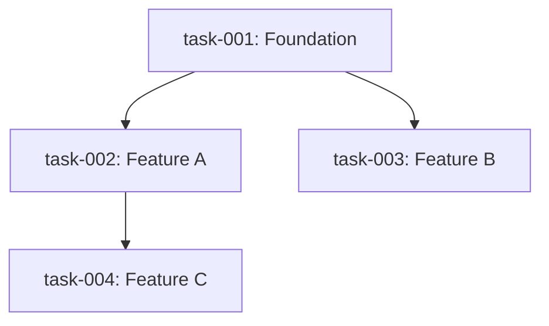

# PRD Task Splitter

Decompose a PRD into individual `task-XXX.md` files — one per unit of work — with
explicit dependency labels and a lifecycle system for tracking progress.

---

## Core Concepts

### Decomposition Hierarchy

```
PRD
└── Epics (major feature areas, e.g. "Data Layer", "Auth", "UI")
    └── User Stories (one user-facing capability per story)
        └── Tasks (one shippable unit of work per file)
```

Each task file should be:
- **Independent** — reviewable and mergeable on its own
- **Vertical** — touches all layers needed to deliver the behavior
- **Estimable** — a developer can size it without ambiguity
- **Testable** — has clear, verifiable acceptance criteria

Use **INVEST** as a quality check per task:

| Letter | Meaning |
|--------|---------|
| **I** | Independent — minimal coupling to other in-progress tasks |
| **N** | Negotiable — scope can be adjusted without breaking the task |
| **V** | Valuable — delivers something observable to a user or system |
| **E** | Estimable — dev can give a rough size |
| **S** | Small — completable in 1–3 days ideally, 5 days max |
| **T** | Testable — acceptance criteria are verifiable |

---

## Task Lifecycle

Status is tracked **only in `_index.md`** — never in individual task files.

### Status Values

| Status | Badge | Meaning |
|--------|-------|---------|
| `todo` | `⬜ todo` | Not started. Default on generation. |
| `in_progress` | `🔵 in_progress` | Actively being worked. |
| `done` | `✅ done` | Confirmed complete by the user. |

### Lifecycle Rules

1. `todo` → `in_progress` only when the user says "pick", "start", or "work on" a task.
2. **Guard:** a task can only be picked if all its `depends_on` tasks are `done`. If not, refuse and name the blocking tasks.
3. `in_progress` → `done` only when the user explicitly confirms. **The agent never self-promotes a task to `done`.**
4. `done` → `in_progress` is allowed if the user requests rework.
5. When a task is marked `done`, immediately announce which tasks just became available to pick next.

### Status Commands

| User says | Action |
|-----------|--------|
| "pick task-003" / "start task-003" | Validate dependencies → set `in_progress` in `_index.md` |
| "what can I work on next?" / "what's available?" | List all `todo` tasks whose `depends_on` are all `done` |
| "mark task-003 as done" / "finish task-003" | Set `done` in `_index.md`, announce newly unblocked tasks |
| "reopen task-003" / "task-003 needs rework" | Set back to `in_progress` |
| "show status" / "what's the current status?" | Print the Task Summary table from `_index.md` |

> When updating status, edit **only** the `Status` column in `_index.md`. Never touch the task file itself.

---

## Step-by-Step Process

### Step 1 — Analyze the PRD

Read the entire PRD. Extract:
1. Goal/purpose of the product
2. User stories or functional requirements
3. Technical constraints (stack, libraries, data model)
4. Non-goals (explicitly out of scope)
5. Open questions — flag these, never silently resolve them

### Step 2 — Identify Epics

Group related requirements into 3–7 epics, named by layer or domain:
- `data-layer` — schema, storage, migrations
- `goal-management` — CRUD for goals
- `logging` — recording daily entries
- `stats` — charts and aggregations
- `navigation` — routing and layout

### Step 3 — Decompose into Tasks

- One task = one PR's worth of work
- Prefer **vertical slices** — ship one feature end-to-end per task
- Exception: a **foundation task** (data model, routing scaffold, shared layout) is a legitimate horizontal slice when everything else depends on it
- If a task feels XL (> 5 days), split it further

### Step 4 — Map Dependencies

For each task:
- `depends_on: []` — task IDs that must be merged before this one starts
- `parallel_safe: true/false` — can it run alongside its wave siblings?

| Dependency type | Meaning | Example |
|-----------------|---------|---------|
| Finish-to-Start | B cannot start until A is done | UI form needs DB schema first |
| Shared foundation | Multiple tasks all need the same base | All features need routing scaffold |
| Data contract | B consumes an interface A defines | Stats chart needs log query API |

> Only mark real dependencies — not preferred order.

### Step 5 — Compute Execution Waves

- **Wave 1** — tasks with no dependencies (foundation, scaffold)
- **Wave 2** — tasks that depend only on Wave 1
- **Wave N** — tasks whose all dependencies are in earlier waves

### Step 6 — Write Task Files

Create one `task-XXX.md` per task (zero-padded). See template below.

---

## Task File Template

```markdown
---
id: task-XXX
title: <Short imperative title>
epic: <epic-name>
wave: <1 | 2 | 3 ...>
depends_on: [task-YYY, task-ZZZ]   # empty list [] if none
parallel_safe: true
estimate: <XS | S | M | L>         # XS=<1d, S=1d, M=2-3d, L=4-5d
---

## Goal
One sentence: what does this task deliver and why does it matter?

## Background / Context
What the implementer needs to know: relevant PRD sections, design decisions,
constraints, or prior art. Keep brief — reference the PRD rather than duplicating it.

## Acceptance Criteria
- [ ] Criterion 1 (observable behavior, not implementation detail)
- [ ] Criterion 2
- [ ] TypeScript/lint passes (if applicable)
- [ ] Unit or integration test covers the happy path

## Technical Notes
Optional. Implementation hints, APIs, schema fields, or edge cases.
Not prescriptive — dev can deviate if justified.

## Out of Scope
Explicit list of things NOT in this task (prevents scope creep).

## Dependencies Detail
| Depends On | Why |
|------------|-----|
| task-YYY   | Needs the DB schema this task defines |

## Open Questions
- Any ambiguity from the PRD that should be resolved before or during this task.
```

---

## Output Structure

```
tasks/
├── _index.md       ← dependency graph + wave table + status tracking
├── task-001.md
├── task-002.md
└── ...
```

### `_index.md` Template

~~~markdown
# Task Index

## Dependency Graph



## Execution Waves

| Wave | Tasks | Parallel? |
|------|-------|-----------|
| 1 | task-001 | — |
| 2 | task-002, task-003 | ✅ Yes |
| 3 | task-004 | Depends on task-002 only |

## Task Summary

| ID | Title | Epic | Wave | Depends On | Estimate | Status |
|----|-------|------|------|------------|----------|--------|
| task-001 | ... | data-layer | 1 | — | S | ⬜ todo |
| task-002 | ... | goal-management | 2 | task-001 | M | ⬜ todo |

> **How to use:** Say "pick task-001" to start a task, or "mark task-001 as done"
> once it passes review. The agent enforces dependency order and updates this table.

## Open Questions (from PRD)

Unresolved PRD questions that affect task scope. Flag for product owner.
~~~

---

## Sizing Guide

| Label | Duration | What fits |
|-------|----------|-----------|
| XS | < 1 day | Schema migration, add a field, wire a toggle |
| S | ~1 day | One CRUD endpoint + basic UI |
| M | 2–3 days | Feature with business logic + UI + tests |
| L | 4–5 days | Complex feature with multiple states, charts, scheduling |

---

## Quality Checklist

- [ ] Every PRD user story maps to at least one task
- [ ] No task is larger than L (5 days)
- [ ] All `depends_on` references point to real task IDs
- [ ] No circular dependencies (A→B→A)
- [ ] Wave 1 contains only truly foundational tasks
- [ ] Parallel-safe tasks in the same wave don't share mutable state
- [ ] Each task has at least 2 acceptance criteria
- [ ] `_index.md` Mermaid diagram accurately reflects all edges
- [ ] Non-goals from the PRD appear in relevant tasks' "Out of Scope"
- [ ] Open questions from the PRD are in `_index.md`
- [ ] Every task in the Task Summary has `⬜ todo` as initial status
- [ ] Usage hint is present below the Task Summary table

---

## Example: Minimal 4-Task Decomposition

```
task-001: Setup DB schema       (Wave 1, no deps)
task-002: Build CRUD API        (Wave 2, depends on task-001)
task-003: Build UI form         (Wave 2, depends on task-001, parallel with task-002)
task-004: Wire UI to API + e2e  (Wave 3, depends on task-002 AND task-003)
```

```
task-001
├── task-002 ─┐
└── task-003 ─┴── task-004
```

task-002 and task-003 can be worked simultaneously once task-001 is merged.

---

## Notes on Special PRD Patterns

**One-time vs. repetitive goals** — create separate tasks for scheduling/logic variations rather than combining into one large task.

**Non-functional requirements** (performance, responsive layout) — attach as acceptance criteria to the relevant feature task, or create a dedicated task if the work is significant enough to stand alone.

**Open questions in PRD** — never silently resolve them. List in `_index.md` and note which tasks are blocked or may need rework pending the answer.